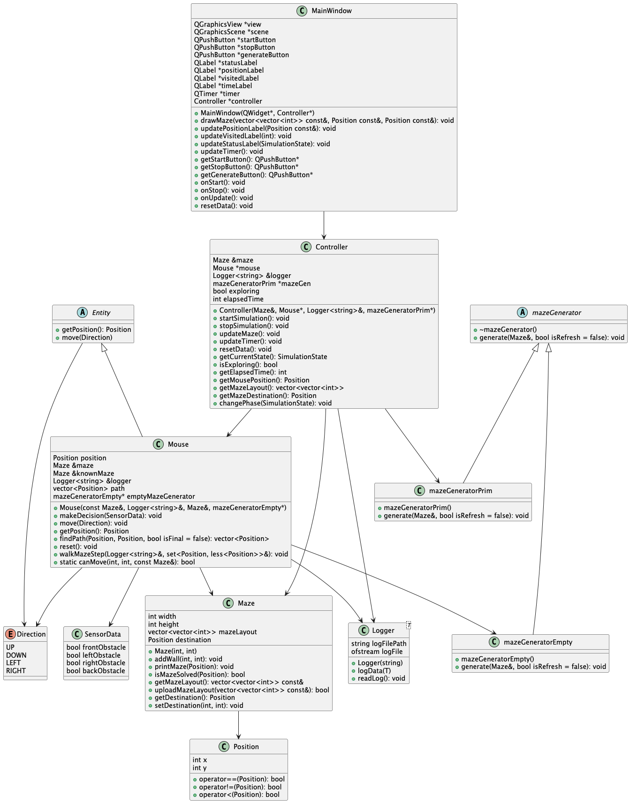

# Micromouse Simulator (Qt/C++)

A **Micromouse** maze-solving simulator written in **C++17** with a **Qt Widgets** GUI and built with **CMake**. It generates a 16×16 maze (Prim’s algorithm), simulates a mouse exploring the maze, returning to start, and then running the final path.

## Table of contents

- [Features](#features)
- [Project structure](#project-structure)
- [Architecture overview](#architecture-overview)
- [Build & run](#build--run)
  - [Requirements](#requirements)
  - [Build (CLI)](#build-cli)
  - [Run](#run)
- [How the simulation works](#how-the-simulation-works)
- [Configuration](#configuration)
- [Logging](#logging)
- [Maze generation](#maze-generation)
- [Class diagram](#class-diagram)
- [Troubleshooting](#troubleshooting)
- [Roadmap / ideas](#roadmap--ideas)
- [License](#license)

## Features

- **Qt Widgets GUI** rendering the maze and current mouse position.
- **Maze generation**:
  - Random maze generator using **Prim’s algorithm** (`mazeGeneratorPrim`).
  - "Empty" maze generator (`mazeGeneratorEmpty`) used as the mouse’s *known* maze.
- **Simulation phases**:
  1. **Exploration** (learn the maze)
  2. **Returning** (go back to start)
  3. **Running** (run to destination using the final path)
- **Step-by-step simulation** driven by `QTimer` ticks.
- **Logging** to files for both high-level events and sensor/step details.

## Project structure

The repository is intentionally small and mostly lives in the root directory:

- `main.cpp` — application entry point and simulation loop wiring (timers, phases).
- `mainwindow.*` / `mainwindow.ui` — Qt Widgets UI and drawing.
- `maze.*` — maze representation, walls/layout, destination.
- `mouse.*` — micromouse logic, movement, exploration steps, and pathfinding.
- `controller.*` — simulation state and orchestration.
- `mazegenerator*.{h,cpp}` — maze generation strategies.
- `logger.h` — minimal templated file logger.
- `resources.qrc` — Qt resources.
- `images/` — textures/images used by the GUI.
- `classDiagram.puml` / `classDiagram.png` — architecture diagram.

## Architecture overview

At a high level:

- `MainWindow` displays the maze and exposes UI actions (Start/Stop/Generate).
- `Controller` holds references to the `Maze`, `Mouse`, and generators and exposes state (`isExploring()` etc.).
- `Mouse` interacts with the maze, makes decisions, and moves step-by-step.
- `Maze` stores the layout (2D grid), walls, and the destination.

The simulation itself is driven from **`main.cpp`** using three timers:

- `explorationTimer` (Exploration phase)
- `returningTimer` (Returning phase)
- `runningTimer` (Final run phase)

Each timer tick calls `mouse.walkMazeStep(...)` and refreshes the GUI.

## Build & run

### Requirements

- **C++17** compiler
- **CMake ≥ 3.16**
- **Qt Widgets** (Qt 5 or Qt 6)

The CMake project enables Qt auto features (`AUTOUIC`, `AUTOMOC`, `AUTORCC`).

### Build (CLI)

```bash
# from repo root
cmake -S . -B build
cmake --build build -j
```

### Run

On macOS/Linux:

```bash
./build/cpp
```

On Windows (example):

```powershell
.\build\Debug\cpp.exe
```

## How the simulation works

The main flow (see `main.cpp`) is:

1. Create a **maze** and an **empty maze** (used as the mouse’s known maze).
2. Create a `Mouse` and a `Controller`.
3. Create the Qt `MainWindow`.
4. Generate the mazes and draw the initial layout.
5. When **Start** is pressed:
   - disable Start/Generate
   - enable Stop
   - start the **Exploration** timer (250 ms steps)
6. When exploration finishes (destination reached or a move limit):
   - switch to **Returning** phase (destination temporarily set to `(0,0)`)
7. When the mouse returns to start:
   - restore original destination
   - compute final path (`mouse.findPath(...)`)
   - switch to **Running** phase
8. When the destination is reached:
   - stop timers
   - mark state as Finished
   - re-enable Start/Generate

## Configuration

- Maze size is currently defined in `main.cpp`:

```cpp
#define MAZE_SIZE 16
```

- Timer step interval is set to **250 ms** in `main.cpp`.

## Logging

Two log files are created (paths are relative to the working directory):

- `../micromouse.log` — high-level simulation events.
- `../micromousesensor.log` — per-step/sensor details.

If you don’t see logs, check your **working directory** when launching the app.

## Maze generation

The simulator includes two generator implementations:

- `mazeGeneratorPrim` — generates a maze using Prim’s algorithm.
- `mazeGeneratorEmpty` — generates an empty/open maze (used for the mouse’s internal map).

The active maze is generated at startup and can be refreshed via the **Generate** button.

## Class diagram

- PlantUML source: `classDiagram.puml`
- Rendered diagram: `classDiagram.png`


